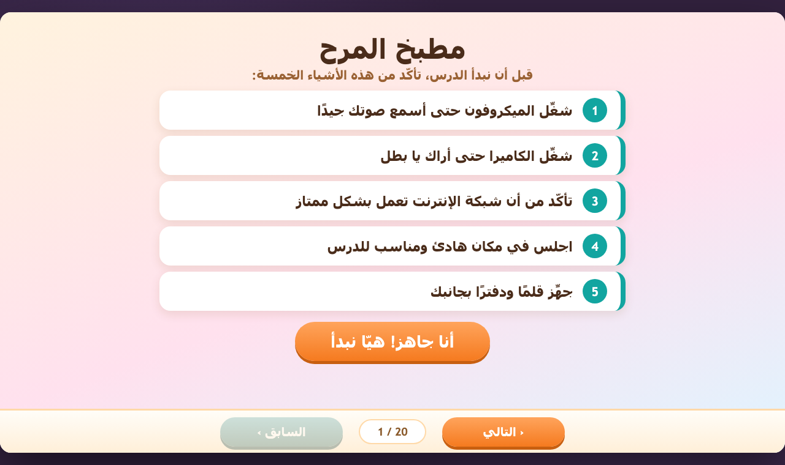
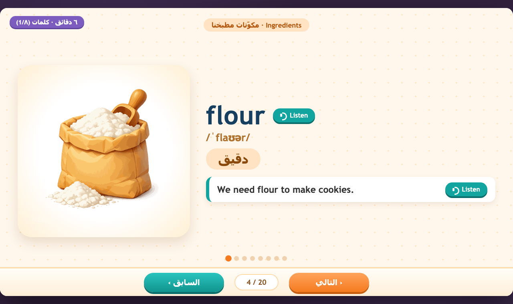
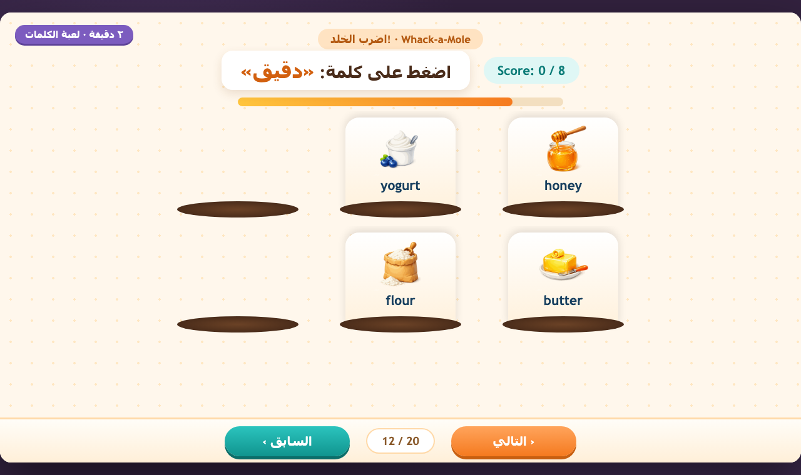
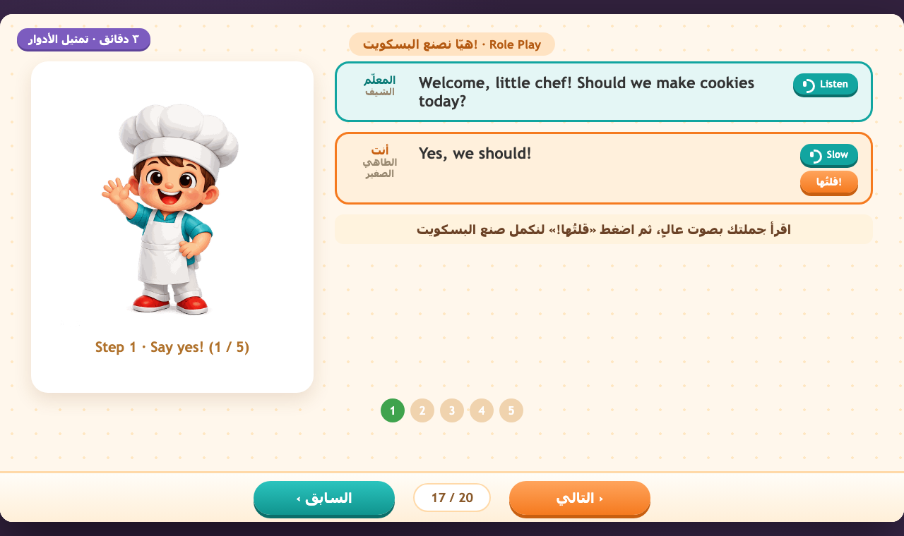

# 胡闹厨房 · Crazy Kitchen 🍳

> 面向沙特小学生的 **25 分钟一对一线上英语课** H5 互动课件
> 教材单元：Unit 4 · Glorious Food — *Make your favorite snack*

纯 HTML / CSS / JavaScript 单文件课件，零依赖、零构建，打开即用。全部配图 AI 实绘生成，无 emoji / SVG 占位；阿拉伯语严格 RTL、英语严格 LTR；1280×720 舞台等比缩放，手机、电脑、任意浏览器比例均完整显示无遮挡。

## ✨ 在线预览

将本仓库开启 GitHub Pages（Settings → Pages → 分支 `main` / 根目录）后，访问：

```
https://<你的用户名>.github.io/crazy-kitchen-courseware/
```

## 🚀 本地运行

直接双击打开 `index.html` 即可；或启动本地服务：

```bash
npm run dev          # 默认 http://localhost:7100/
npm run dev -- --port 8080
```

## 📚 课程内容

**核心单词（8 个）**：flour · butter · sugar · honey · chocolate · yogurt · topping · recipe
**拓展词**：oven · countertop
**语法**：用 `should (not)` 提建议 · 用 `had better (not)` 发警告

## 🗺️ 页面流程（20 页 / 25 分钟）

| 页码 | 环节 | 说明 |
|------|------|------|
| P1 | 课前通知 | 全阿语 checklist：麦克风 / 摄像头 / 网络 / 安静环境 / 文具 |
| P2 | 破冰 | 小厨师互动打招呼 + 问答句卡 |
| P3 | Free Talk | 食物图卡 + 师生自由对话句型 |
| P4–11 | 单词讲解 | 配图 + 音标 + 阿语含义 + 例句 + 点读发音 |
| P12 | 单词游戏 | 打地鼠（听阿语含义选英文单词，8 轮计时） |
| P13 | 单词游戏 | 图文匹配两轮，原料飞入购物篮 |
| P14–15 | 语法讲解 | should = نصيحة 建议 / had better = تحذير 警告 |
| P16 | 语法游戏 | 厨房警报：句子分类投进「建议桶 / 警告桶」+ 口头抢答 |
| P17 | Role Play | 5 步师生对话做饼干，开口说一句推进一步 |
| P18 | 课堂总结 | 今日菜谱卡，8 词点读 + 语法公式 |
| P19 | Exit Quiz | 4 题快答（词义 ×2 + 语法 ×2），星级结算 |
| P20 | 教师反馈 | 全阿语：表现 / 优点 / 薄弱点 / 补习计划 + 星级评分，本地保存 |

## 🎮 功能特性

- 🔊 单词与例句发音：调用浏览器原生英文语音（优选 en-US），离线可用
- 🎵 游戏音效：答对 / 答错 / 打中 / 庆祝 4 组 AI 生成音效
- 🧭 底部固定「السابق ‹ / › التالي」翻页 + 页码，支持键盘 ← → 与 `#p=N` 直达
- 📱 等比缩放适配任意屏幕比例
- 🌐 阿拉伯语 `dir="rtl"` / 英语 `dir="ltr"` 严格分离

## 📁 目录结构

```
├── index.html        # 课件主文件（单文件，含全部页面与游戏逻辑）
├── server.js         # 零依赖本地静态服务器
├── package.json
├── assets/
│   ├── img/          # 15 张 AI 实绘配图（共约 0.7 MB）
│   └── audio/        # 4 个游戏音效
└── docs/             # README 截图
```

## 📸 课件预览

| 课前通知（阿语 RTL） | 单词讲解 |
|:---:|:---:|
|  |  |

| 打地鼠游戏 | Role Play |
|:---:|:---:|
|  |  |

## 👩‍🏫 使用建议

- 教师按页推进即可，每页右上角时间胶囊标注建议时长，合计 25 分钟
- 发音按钮需学生/老师点击触发（浏览器自动播放策略）
- P20 反馈页内容保存在浏览器 localStorage，刷新不丢失
